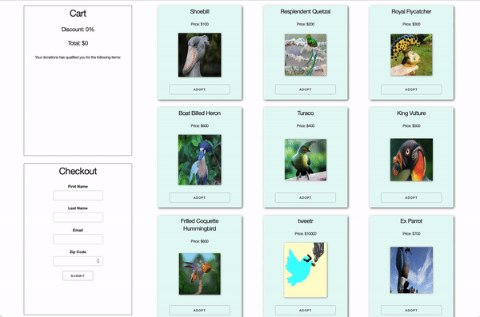

# Bird Sanctuary

## Getting Started

- Fork this repo
- Clone the forked repository
- `cd` to the directory where you cloned it
- `npm install` to install dependencies
- `npm run cypress` to open the cypress testing window

> _Note_: Remember to `git add`, `git commit` and `git push` regularly

## Submission Guidelines

- When finished, commit and push your work.
- Make a pull request on github.
- Submit the link to your pull request on Canvas.

This project is designed to assess the React skills you have gained so far.

There are 7 features that need to be implemented. Each completed function (passes all the tests) will be worth 1 point.

A minium of 5 points must be attained in order to pass this assessment.

You may receive partial credit (0.5 points) for code that is close to passing the tests, but does not pass all the tests.

## Assessment Details

Create a bird sanctuary donation app that meets the user stories below.

**The birds are in the array in `src/data/birds.js` and the bonus itesms are in `src/data/bonusItems.js`. Import these and pass them to your components. Use these items and do not change any information in the array, or else the tests will fail.**

The following demo has been styled for clarity. You do not need to style this app.

## User Stories

1. I can see sections with birds, that have a name, image, amount and adopt button.
1. I can add birds to the shopping cart.
1. I can see a total cost of the birds in my cart.
1. I can get a 10% discount if I have 3 or more birds in my cart
1. I can get a series of bonus items for increasing cart totals
1. I can use a form to checkout my cart, upon checkout, it resets my cart
1. I can delete a bird from my cart

## Acceptance criteria and tests

The acceptance criteria below are covered by unit tests. Notice that there are some important details about the exact text, classes, or HTML tags you'll need to use in order to pass the tests.

Your react app should be made up of a minimum of 3 components:

- bird card(s)
- checkout
- cart

### Birds

- The bird data comes from `src/data/birds.js`
- Each bird card displays the name, image, and amount (price)
- Each bird card has a class name of `card`
- Each bird card has an `Adopt` button
  - The button text should be: `Adopt`

### Cart

- The cart has a class name of `Cart`
- When I click on a bird card's adopt button, its name appears in the cart as an `<ol>` list item.
- The total shows up as an `<h4>` element inside the cart
- When I click on an additional item, the total cost is updated and additional bird name(s) is added as a list item to the unordered list
- When there are less than 3 birds in the cart there is a 0% discount
- When there are 3 or more birds in the cart there is a 10% discount

The bonuses come from `src/data/bonusItems.js`

- The bonus items are added as list items in an `<ul>` list item as follows:
- 1 bonus (first array item) is given if the total is between 100 and 300
- 2 bonuses (first and second array items) are given if the total is between 300 and 500
- 3 bonuses are given if the total is between 500 and 1000
- 4 bonuses are given if the total is more than 1000

### Checkout

- I can complete the inputs in the checkout form.
- When I complete the form with valid input and click `Submit`, an alert tells me the purchase was successful.
  - Alert text should include: `You have adopted birds. Thank you!`
- When I close the alert box, the cart component should fully reset (no birds, no discount, total = 0, no bonus items listed)

## Help and tips

- Before you write any code, think about your component structure.

  - What components will you need to represent the parts of the app?
  - Which components will need to have state?
  - Which components will need to know about the state of **other components**?
  - Which components will need to get props (data or callbacks) from another component?
  - Which components will be rendered by other components?
  - Draw out your component structure. Check your drawing against the user stories. Will you be able to implement all of the stories with this structure?

- If your tests are failing, read the acceptance criteria closely. Some tests expect you to use specific text, classes, or HTML elements.

## Academic Integrity

This project is to help you assess your progress in learning React.

- Do this project **on your own**.
  - Do not pair programwith other fellows or submit one project for more than one person .
  - Do not refer to work from other (current or former) fellows.
  - Do not ask individuals outside the program for help.
- You can refer to any notes that you have.
- You can talk to other students and use slack to help work out bugs.
- You can go to office hours
- You can Google anything you want, but do not copy any code that you do not understand.
- Your instructors are here to help you with technical difficulties.
  - Make sure that the tests are running on your computer. If not, tell an instructor ASAP.
  - Make sure that you can fork and clone the repo and run the app. If not, tell an instructor ASAP.
# Birds
